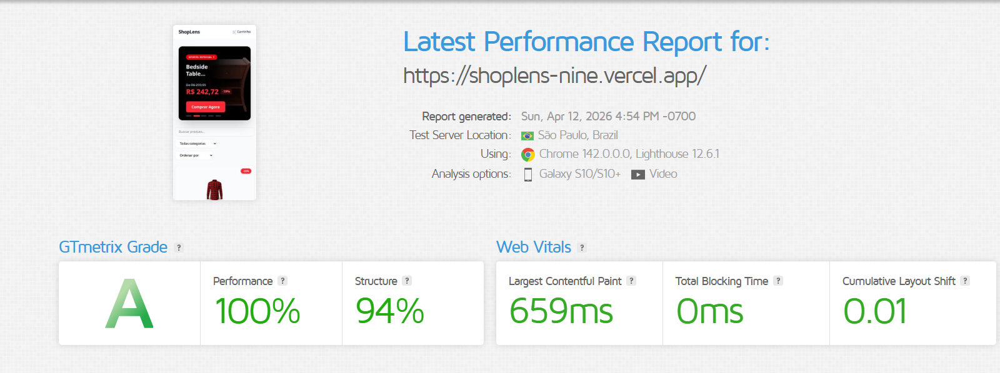

# React E-commerce

Um front-end de e-commerce moderno e performático construído com as tecnologias mais recentes do ecossistema React. O projeto serve como um exemplo prático de uma arquitetura escalável e baseada em features, utilizando Vite, TypeScript, Zustand, React Query e Tailwind CSS.



[**Acessar o Deploy**](https://shoplens-nine.vercel.app/)

## ✨ Features

- **Listagem de Produtos:** Navegação por uma lista de produtos com paginação e scroll infinito.
- **Busca Dinâmica:** Filtro de produtos em tempo real com debounce para otimizar as chamadas à API.
- **Carrinho de Compras:** Adicione e gerencie produtos no carrinho com estado global persistente.
- **Design Responsivo:** Interface totalmente adaptável para desktops, tablets e dispositivos móveis.
- **Performance Otimizada:**
  - Carregamento lento (lazy loading) de imagens.
  - Virtualização de listas para renderizar apenas itens visíveis.
  - Memoização de componentes para evitar re-renderizações desnecessárias.
  - Cache de API com React Query para uma experiência de usuário mais rápida.

## 🛠️ Tecnologias Utilizadas

- **Framework:** [React 18](https://reactjs.org/)
- **Build Tool:** [Vite](https://vitejs.dev/)
- **Linguagem:** [TypeScript](https://www.typescriptlang.org/)
- **Estilização:** [Tailwind CSS](https://tailwindcss.com/)
- **Gerenciamento de Estado:** [Zustand](https://github.com/pmndrs/zustand)
- **Data Fetching & Cache:** [React Query](https://tanstack.com/query/v4/)
- **API:** [DummyJSON](https://dummyjson.com/) (API REST de exemplo)

## 📂 Arquitetura

O projeto segue uma arquitetura **feature-based**, onde a lógica, os componentes e os hooks são agrupados por funcionalidade (ex: `products`, `cart`). Isso promove a coesão e o baixo acoplamento, facilitando a manutenção e a escalabilidade.

```
src/
├── features/
│   ├── products/   # Feature de Produtos
│   └── cart/       # Feature do Carrinho
├── shared/
│   ├── api/        # Camada de acesso à API
│   ├── hooks/      # Hooks reutilizáveis
│   ├── types/      # Tipos e interfaces do domínio
│   └── utils/      # Funções utilitárias puras
├── store/          # Stores globais (Zustand)
├── App.tsx         # Componente raiz
└── main.tsx        # Ponto de entrada da aplicação
```

## 🚀 Rodando o Projeto

Siga os passos abaixo para executar o projeto em seu ambiente de desenvolvimento.

### Pré-requisitos

- [Node.js](https://nodejs.org/en/) (versão 18 ou superior)
- [pnpm](https://pnpm.io/) (ou `npm`/`yarn`)

### Instalação

1. Clone o repositório:

   ```bash
   git clone https://github.com/seu-usuario/react-ecommerce.git
   ```

2. Navegue até o diretório do projeto:

   ```bash
   cd react-ecommerce
   ```

3. Instale as dependências:
   ```bash
   pnpm install
   ```

### Execução

Para iniciar o servidor de desenvolvimento, execute:

```bash
pnpm dev
```

A aplicação estará disponível em `http://localhost:5173`.

## 📜 Scripts Disponíveis

- `pnpm dev`: Inicia o servidor de desenvolvimento com Vite.
- `pnpm build`: Compila o projeto para produção.
- `pnpm preview`: Inicia um servidor local para visualizar a build de produção.
- `pnpm lint`: Executa o ESLint para analisar o código em busca de problemas.

## 🤝 Contribuições

Contribuições são bem-vindas! Se você encontrar um bug ou tiver uma sugestão de melhoria, sinta-se à vontade para abrir uma **Issue** ou um **Pull Request**.

---

Feito com ❤️ por [Matheus Soares](https://github.com/theussoares).

This template provides a minimal setup to get React working in Vite with HMR and some ESLint rules.

Currently, two official plugins are available:

- [@vitejs/plugin-react](https://github.com/vitejs/vite-plugin-react/blob/main/packages/plugin-react) uses [Oxc](https://oxc.rs)
- [@vitejs/plugin-react-swc](https://github.com/vitejs/vite-plugin-react/blob/main/packages/plugin-react-swc) uses [SWC](https://swc.rs/)

## React Compiler

The React Compiler is not enabled on this template because of its impact on dev & build performances. To add it, see [this documentation](https://react.dev/learn/react-compiler/installation).

## Expanding the ESLint configuration

If you are developing a production application, we recommend updating the configuration to enable type-aware lint rules:

```js
export default defineConfig([
  globalIgnores(["dist"]),
  {
    files: ["**/*.{ts,tsx}"],
    extends: [
      // Other configs...

      // Remove tseslint.configs.recommended and replace with this
      tseslint.configs.recommendedTypeChecked,
      // Alternatively, use this for stricter rules
      tseslint.configs.strictTypeChecked,
      // Optionally, add this for stylistic rules
      tseslint.configs.stylisticTypeChecked,

      // Other configs...
    ],
    languageOptions: {
      parserOptions: {
        project: ["./tsconfig.node.json", "./tsconfig.app.json"],
        tsconfigRootDir: import.meta.dirname,
      },
      // other options...
    },
  },
]);
```

You can also install [eslint-plugin-react-x](https://github.com/Rel1cx/eslint-react/tree/main/packages/plugins/eslint-plugin-react-x) and [eslint-plugin-react-dom](https://github.com/Rel1cx/eslint-react/tree/main/packages/plugins/eslint-plugin-react-dom) for React-specific lint rules:

```js
// eslint.config.js
import reactX from "eslint-plugin-react-x";
import reactDom from "eslint-plugin-react-dom";

export default defineConfig([
  globalIgnores(["dist"]),
  {
    files: ["**/*.{ts,tsx}"],
    extends: [
      // Other configs...
      // Enable lint rules for React
      reactX.configs["recommended-typescript"],
      // Enable lint rules for React DOM
      reactDom.configs.recommended,
    ],
    languageOptions: {
      parserOptions: {
        project: ["./tsconfig.node.json", "./tsconfig.app.json"],
        tsconfigRootDir: import.meta.dirname,
      },
      // other options...
    },
  },
]);
```
